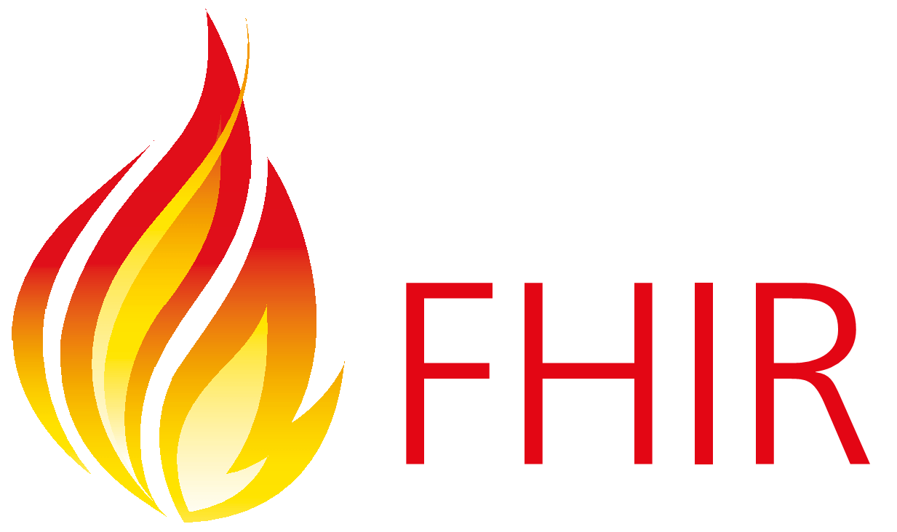

# FHIR Engineer

## The Role

As a FHIR Engineer at Oddball, you'll work on building and optimizing systems that use the FHIR (Fast Healthcare Interoperability Resources) standard for healthcare data exchange. Your primary responsibility will be to design backend solutions that ensure smooth, secure, and scalable communication between healthcare systems using FHIR, both as a file format and an API protocol.

We’re looking for forward-thinking candidates who have a deep understanding of FHIR and can apply it to real-world healthcare problems, on the consumer and producer ends.

---

## Your Next Steps: The Challenges

We’ve designed a challenge to assess your understanding of the FHIR protocol and your ability to implement solutions based on it. These tasks reflect a scaled down version of the kind of work you'll be doing in the role. Our HR team will share the details of your assigned challenge.

- [FHIR API Client](fhir-api-client/README.md)
- [FHIR Import and Transform](fhir-import/README.md)
