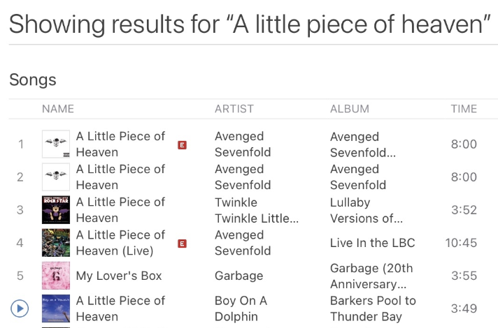

# iTunes Search Challenge

## Overview

The goal of this challenge is to create a frontend that allows users to search the iTunes database and display the results in a user-friendly, visually appealing, and mobile-responsive interface. Candidates will demonstrate their proficiency in frontend development, UI/UX design, and working with APIs.

The challenge will be assessed based on:

- **Code quality**: How clean, modular, and maintainable is the code?
- **User interface**: How intuitive, attractive, and responsive is the UI?
- **Functionality**: How well does the application meet the requirements and handle edge cases?
- **Creativity**: How creatively does the candidate approach the design and functionality?

---

## Requirements

### 1. **Search Functionality**
- Allow the user to search for music (albums, songs, artists, etc.) in the iTunes database.
- **Keyword search**: Users should be able to search by keyword (e.g., artist name, song title, album name).
- **Filter by category**: The search should allow filtering by type, such as **music**, **albums**, **songs**, etc., while excluding **podcasts**, **movies**, etc.
- **Explicit filter**: Users should be able to specify if they want to allow or exclude explicit content in the search results.
  
### 2. **UI/UX Design**
- **Responsive Design**: The UI must be mobile-friendly. It should adjust smoothly to different screen sizes and orientations.
- **Search results display**: Each result should show:
  - Title (song, album, or artist)
  - Artist (if applicable)
  - Thumbnail image (album artwork or artist image)
  - Preview (optional: audio preview link or video preview if available)
  - Explicit content label (if explicit content is present in the result)
  
- **Pagination**: Ensure pagination is in place if the results exceed the maximum number of items per page.
  
- **Search input**: Create an intuitive and clean search bar where users can type in their search queries. It should support suggestions or auto-complete (optional).
  
- **Optional Features**:
  - Play a preview audio or video snippet from the search results.
  - Implement search suggestions as the user types (optional but encouraged).

### 3. **Error Handling and Edge Cases**
- Handle scenarios like:
  - No results found (display a friendly message to the user).
  - API errors (e.g., server downtime, invalid requests).
  - Malformed input (e.g., empty search, invalid characters).

---

## Submission Guidelines

### 1. **GitHub Repository**
- Create a **public GitHub repository** to submit your solution. The repository should contain the full implementation, including any required files (HTML, CSS, JavaScript, etc.).
- The repository must include:
  - A **clear, concise README** with the following:
    - Description of the project.
    - Any other details that would help us understand your implementation (e.g., architectural decisions, libraries used, etc.).
  - **Code Comments**: Ensure your code is well-commented to explain key sections of your logic, especially any complex or non-obvious parts.

### 2. **Project Deployment**
- Host your project on a service like Netlify, Vercel, Supabase, Cloudflare, Supabase or GitHub Pages
- Provide a link to the live project in your README file.
- If deploying isn't possible or you run out of time, provide clear instructions in the README on how to run the project locally (e.g., installation steps, commands to run the development server, etc.) 

---

## Bonus (Optional)
- **Unit Tests**: Add unit tests for key components, such as the search functionality or pagination.
- **Accessibility**: Implement basic accessibility features (e.g., keyboard navigation, ARIA labels).
- **Advanced Search Options**: Implement additional filters like genre, release date, or country.
- **State Management**: Use a state management solution (e.g., Redux or Context API in React) to manage application state effectively, especially as the app grows.
  
---

## Evaluation Criteria

### Code Quality:
- Is the code modular and organized?
- Are best practices in terms of coding standards followed (naming conventions, file organization)?
- Is the code reusable, scalable, and maintainable?

### UI/UX:
- Is the interface user-friendly and easy to navigate?
- Is the design visually appealing?
- How well does it respond to different screen sizes (e.g., mobile, tablet, desktop)?
  
### Functionality:
- Does the app meet all the core requirements (search by keyword, filtering, pagination, etc.)?
- Does the application handle errors gracefully?
  
### Creativity:
- How unique or interesting is the approach to the user interface and functionality?
- Were additional features (like audio previews, search suggestions) implemented in a creative way?

---

By submitting this challenge, you’ll have the opportunity to demonstrate your technical skills, creativity, and problem-solving abilities in a real-world application scenario. We look forward to reviewing your work!
