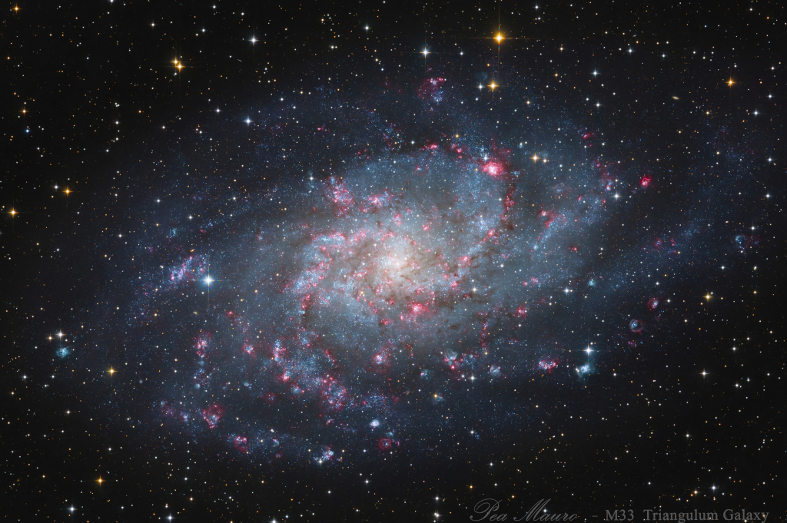

# NASA Astronomy Picture of the Day (APOD) App

## Description

Create a web application that will display NASA’s “Astronomy Picture of the Day” (APOD) for a specified timeframe, 
allowing users to explore a week’s worth of celestial wonders.

### API Integration

- Fetch data from NASA’s APOD API, which is documented at [https://api.nasa.gov/]. Use `DEMO_KEY` for the API key or register for your own API Key if you hit the limit.
- Retrieve a list of images and their associated information for a 7 day period.
- Cache the results locally, so that you don't hit the API for redundant data.
- Employ proper error handling to gracefully manage API call failures.
  
### Image Display

- Allow a user to toggle through dates, pulling the past 7 days of photos relative to that date.
- Employ an efficient scrolling mechanism or carousel.
- Display each image in a 1:1 aspect ratio, ensuring a visually appealing layout for multiple screen sizes.
- Use best practices of the respective front end framework of choice.
- Web app should be mobile friendly and use fluid resizing and responsive behavior.

### Favoriting System

- Implement a robust mechanism for users to mark images as favorites, using an in-browser storage mechanism.
- Allow users to view a dedicated section or page for their favorited pictures.
