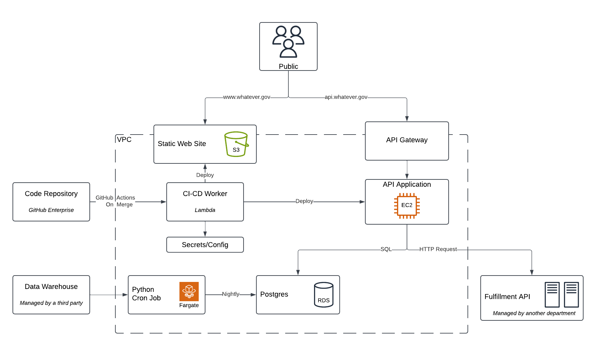

# Whatever.gov

Welcome to the hypothetical government service called whatever.gov! In this excercise, you are consulting with our team on how to improve our website and solve a few problems that we are having.

Please read this overview and get a general understanding of the product and architecture prior to the interview. This document gives you a skeleton overview of the system, but does not delve into the fine details.

When you come into the interview, that will be your chance to ask more questions about this theoretical product and system. You will ask questions to better understand the architecture and desired outcomes. From that free-flowing discussion, we'd love to hear your suggestions about how we might improve this architecture's scalability, performance and security posture.

## Product Introduction

We run a public-facing website that serves users who either already have drug coverage and those looking to sign up for a plan. Users can browse the site either authenticated or unauthenticated.

The public experience allows them (not logged in) to search for available plans by region and features. They can also request plan information be mailed to them, through a third party fulfillment service.

If they create an account and login, they can pull up their enrollment information that shows their current plan. This includes their plan’s features. As they browse through the available plans, it will compare their plan’s features and costs against it.

They can not sign up or change plans directly on our site. However, we link them to an external site for that application process.

## Tech Stack

- Hosted on Amazon Web Services (AWS)
- Postgres database running on RDS
- Angular-based front end website, which is static and hosted on S3
- API uses NodeJS and Express, hosted on EC2
- Authenticated endpoints have a guard, which uses an Authorization header using a Base64 encoded Basic Authentication scheme
- For certain requests, we broker the call to another backend API that we call the Fulfillment API. It is managed by a different government program.
- We host a copy of the beneficiary’s current plan, but we are not the source of truth. A cron job updates our database nightly with any delta.

## Architecture Diagram

## Problems Enhancements

- We hope to improve overall site performance and responsiveness.
- We have noticed some significant API slow downs at unpredictable intervals.
- We have been asked to review and improve our security posture.
- We would like to ensure high availability to hit the government required 99.99% SLA.

## Database Structure

| Table Name | Columns |
| ----------- | ----------- |
| beneficiary | beneficiary_id, fname, lname, sex, ssn, birthdate, address, city, state, zip_code |
| beneficiary_to_plan | beneficiary_id, plan_id, start_date, end_date |
| plan | plan_id, plan_name, insurer_name, status, description, avg_monthly_cost, avg_copay_amount, annual_deductible, min_age, max_age |
| plan_feature | plan_id, feature_key, feature_value |
| plan_to_zip | plan_id, zip_code |
| user | username, password, email, beneficiary_id |

